# 🌌 Ajwa Shahid | Dev Profile

 💫 About Me:
👋 Hi, I'm Ajwa Shahid  🎓 BS Computer Science Student @ FAST National University 💻 Learning C++, Python, HTML, CSS & Git 🚀 Building projects in C++, Python & Web Development 💡 Interested in AI, Cybersecurity & Software Development 🌐 Portfolio: https://ajwashahid150-source.github.io/Portfolio/ 📫 Contact: ajwashahid150@gmail.com

## 🌐 Socials:
   

# 💻 Tech Stack:
          
# 📊 GitHub Stats:
 
 

---

<!-- Proudly created with GPRM ( https://gprm.itsvg.in ) -->

-
